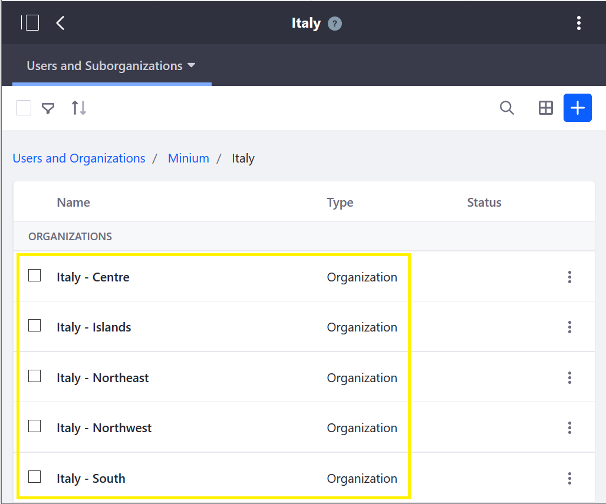
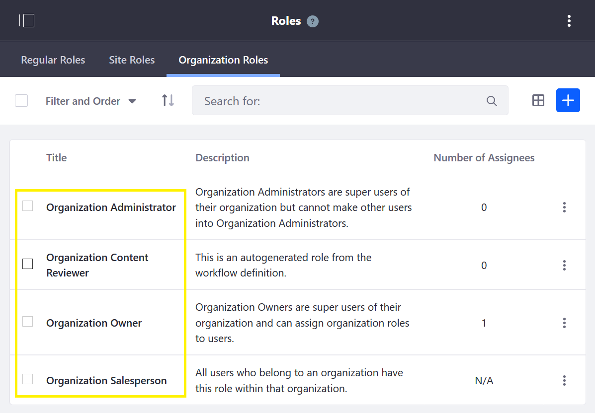
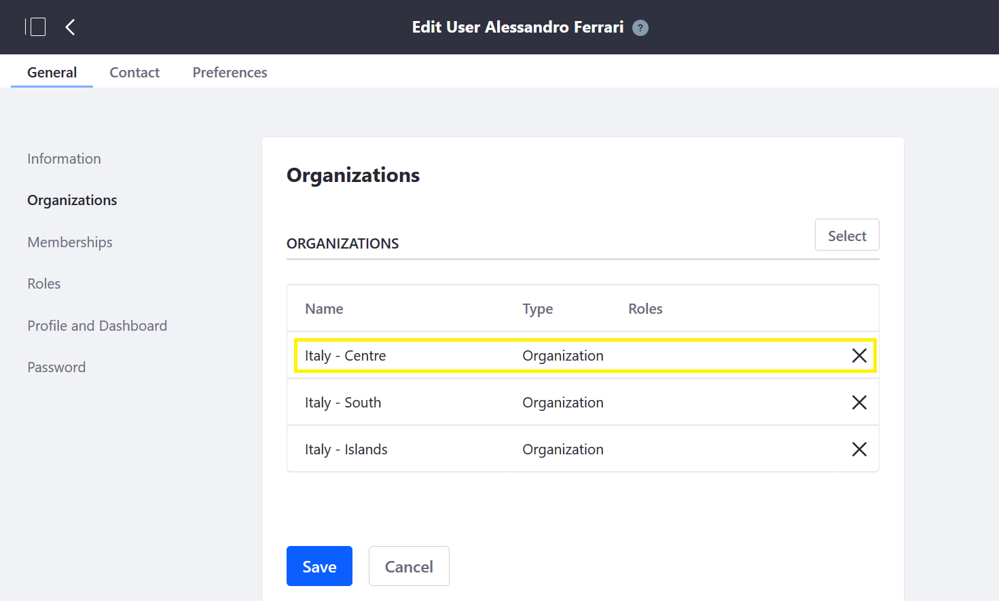

# Using Organizations to Create a Sales Network

A B2B business' real world sales network hierarchy can be mirrored in Liferay Commerce running on DXP using the Organizations feature. In Commerce and DXP, an Organization is a hierarchical arrangement of Users that can model real-world organizational hierarchies – such as a sales network – and that enables distributed and simplified management of Users, Roles, Permissions and Accounts, for enhanced security and collaboration.

> **Note:** A Role is a collection of permissions that can be granted to a User. A Permission is any specific assignable action a User may take, such as view a menu, account or widget, assign Roles, add Users, etc. For more on Roles and Permissions, see _____.

When Organizations are used along with assigning permissions to Organization Roles, users simply need to be assigned to an organization to inherit the correct permissions that were defined for it. For example, a B2B company can give everyone in their sales network access to the right account information through their organizational membership.

Additionally, when someone transfers to another part of the organization, simply move the user to another organization in Liferay Commerce and there's no need to hassle with updating the user's individual roles and permissions. For example, a B2B company can quickly and easily add or remove access to account information when there are sales network personnel changes, by simply changing the user's organizational membership.

Next, we'll illustrate each of these aspects of using Organizations to create a sales network.

## Mirror Real-World Organizational Hierarchies

   

Organizing sales network and accounts exactly as in the real world makes it easy for sales team members to navigate within Liferay Commerce.

## Define Account Access With Organizational Roles and Permissions

   

Assigning roles to every salesperson specifies what they can and can't do within Liferay Commerce (that is, once permissions are defined and assigned to roles).

   

Assigning a collection of permissions to each role defines that role within Liferay Commerce (which can then be applied to users). In addition, ____ can create new/custom permissions

Some examples of permissions include: view sub-Organizations (for example, Regions), account data or order history; edit orders, receive notifications, and assign roles. For more on Permissions, see ______.

## Manage Long-Term Access With Organizational Membership

In Liferay Commerce, once Organizations, Roles and Permissions are set up and assigned, administrators in a B2B business are ready for any personnel changes or structural reorganization that arise.

   

For example, if a salesperson's status changes (hired, promoted, changes regions, leaves the company, etc.), his role and permissions can easily be changed by an administrator indirectly by simply moving his organizational membership, as opposed to having to manage each individual permission assigned to that person.

(Double/Dual-Screenshot: Show User's permissions before the move and after the move)

## Organized, Defined, & Managed Account Access

Once a B2B business takes these steps with Liferay Commerce, it has clear organization, proper access, and easy administration. The business mirrors its real-world organizational hierarchy in its digital environment, it gives access to the right people with the right information, and it has made it quicker and easier to administer access over time.

For articles that show step-by-step how to create a sales network, see the **Additional Information** section, below.

## Using Organizations for A Wide Variety of Solutions

This article shows one way that a B2B business could use Organizations in Liferay Commerce - by creating a sales network. Again, Organizations, Roles & Permissions are a versatile feature of Liferay Commerce on DXP, and there are many possible uses.

## Additional Information

* [Creating and Managing Organizations](https://learn.liferay.com/dxp-7.x/users-and-permissions/organizations/creating-and-managing-organizations.html)
* [Adding a New Organization Type](https://learn.liferay.com/dxp-7.x/users-and-permissions/organizations/adding-a-new-organization-type.html)
* [Managing Roles](https://help.liferay.com/hc/en-us/articles/360018174371-Managing-Roles)
* [Defining Role Permissions](https://help.liferay.com/hc/en-us/articles/360018174391-Defining-Role-Permissions)
* [Connecting Accounts and Organizations](about:blank)
